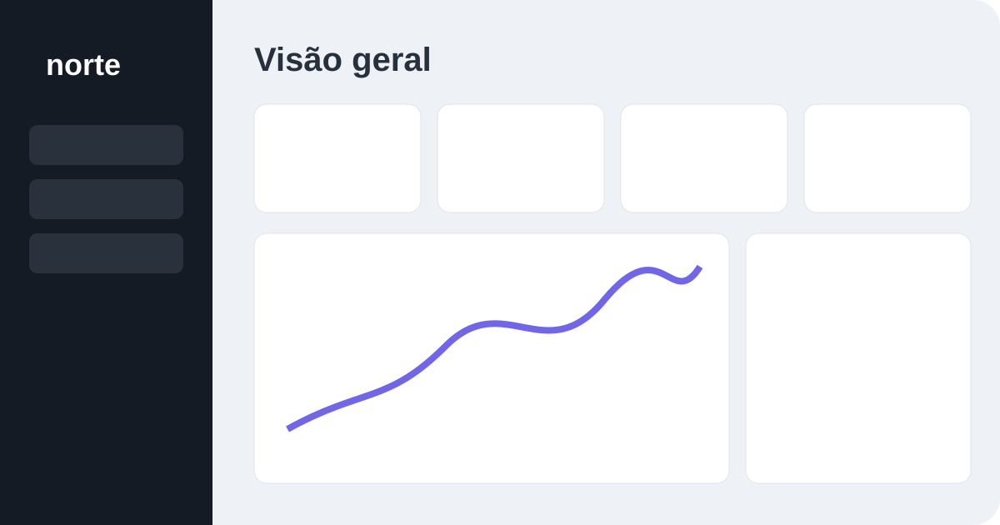

# Norte — Dashboard administrativo

[](https://github.com/RBC-ImktNet/norte-dashboard/actions/workflows/deploy-pages.yml) [](LICENSE)

[](https://rbc-imktnet.github.io/norte-dashboard/) [](https://react.dev/)



## Demonstração online

**[Abrir Norte Dashboard](https://rbc-imktnet.github.io/norte-dashboard/)**

Dashboard administrativo responsivo desenvolvido com React e TypeScript para visualizar métricas de vendas, pedidos, canais de aquisição e atividades operacionais.

## Funcionalidades

- Indicadores de receita, pedidos, ticket médio e reembolsos
- Filtro por diferentes períodos
- Gráfico de receita criado com SVG
- Distribuição de vendas por canal
- Busca instantânea de pedidos e clientes
- Tabela de pedidos com estados de pagamento
- Feed de atividades em tempo real
- Central de notificações
- Menu administrativo responsivo

## Tecnologias

- React
- TypeScript
- Vite
- Lucide React
- SVG e CSS responsivo

## Como executar

```bash
npm install
npm run dev
```

O endereço local será exibido pelo Vite, normalmente `http://localhost:5173`.

## Scripts

```bash
npm run dev      # inicia o desenvolvimento
npm run build    # gera o build de produção
npm run lint     # verifica a qualidade do código
npm run preview  # visualiza o build localmente
```

## Estrutura

```text
src/
├── App.tsx       # métricas, dados, filtros e componentes
├── main.tsx      # inicialização da aplicação
└── styles.css    # layout administrativo e responsividade
```

## Dados

Os dados são demonstrativos e ficam definidos no próprio front-end. O projeto pode ser integrado posteriormente a uma API ou banco de dados sem alterar a estrutura visual principal.

## Compatibilidade

Interface responsiva desenvolvida para navegadores modernos, em dispositivos móveis e desktop.

## Licença

Distribuído sob a licença MIT. Consulte o arquivo [LICENSE](LICENSE).
